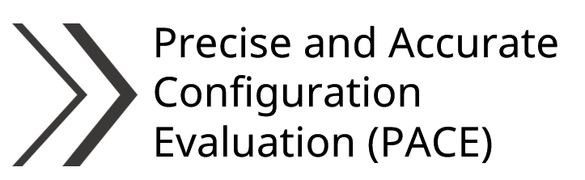

<!-- <h1 align="center">PACE (Precise and Accurate Configuration Evaluation)</h1>

<h4 align="center">

</h4> -->

<p align="center">
  
</p>
<br/>


[](https://choosealicense.com/licenses/mit/)
[](https://opensource.org/licenses/)
[](http://www.gnu.org/licenses/agpl-3.0)


The workbook contains the code and notebook to run PACE (Precise and Accurate Configuration Evaluation).


## 🚀 Environment Setup
- System requirements: This package requires a standard Linux computer with GPU (supports CUDA >= 10) and enough RAM (> 2 GB). The code has been tested NVIDIA V100 SXM2. If you want to run the code on a GPU that does not support CUDA>=10, you need to modify the versions of PyTorch and CUDA in the [env.yml](env.yml) file.
- We'll use `conda` to install dependencies and set up the environment for a Nvidia GPU machine.
We recommend using the [Miniconda installer](https://docs.conda.io/projects/miniconda/en/latest/miniconda-other-installer-links.html).
- After installing `conda`, install [`mamba`](https://mamba.readthedocs.io/en/latest/) to the base environment. `mamba` is a faster, drop-in replacement for `conda`:
    ```bash
    conda install mamba -n base -c conda-forge
    ```
- Then create a conda environment and install the dependencies:
    ```bash
    mamba env create -f env.yml
    ```
    Activate the conda environment with `conda activate pace-env`. It will take about 10 minutes to configure the environment for running code.


## ⚙️ Installation

```sh
pip install pace
```

if PyPI installation fails or you need the latest `main` branch commits, you can install from source:

```sh
pip install git+https://github.com/dixitmudit/PACE.git
```
    
## 🧪 Usage

### 1. Direct Usage

```bash
  python main.py --model /path/to/your/mace/model.model --metals Fe-Ru Fe-Mo --adsorbates Li2S Li2S2 --device cuda
```

### 2. Example notebook
[](https://github.com/dixitmudit/PACE/blob/main/examples/pace-results.ipynb)

[](https://github.com/dixitmudit/PACE/blob/main/examples/pace-results.ipynb)
```bash

```

## 🌈 Acknowledgements

This code repo is based on several existing repositories:


## 📝 Citation
If you find our work useful, please consider citing it:
 /TBU/
```bibtex


```